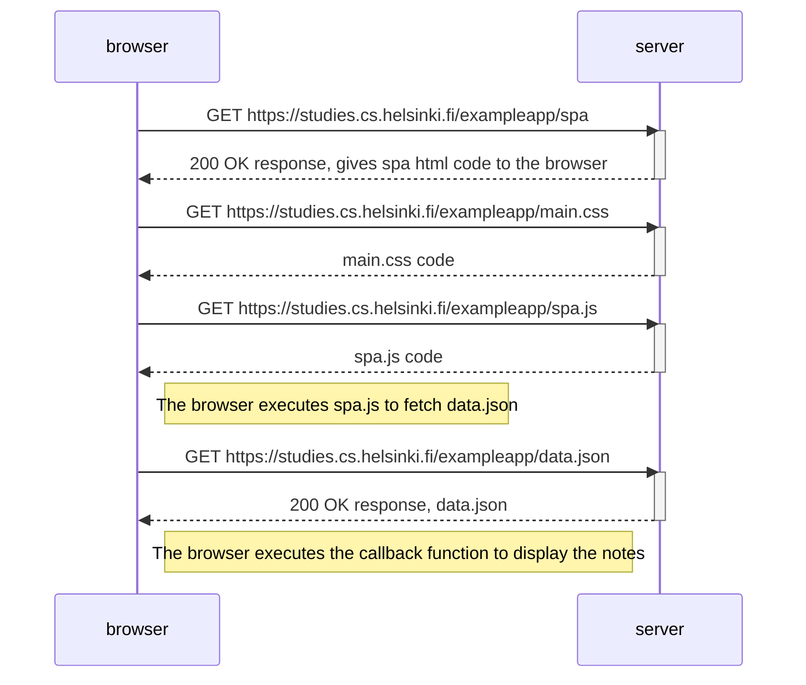

```mermaid
    sequenceDiagram
    participant browser
    participant server

    browser->>server: GET https://studies.cs.helsinki.fi/exampleapp/spa

    activate server
    server-->>browser: 200 OK response, gives spa html code to the browser
    deactivate server

    browser->>server: GET https://studies.cs.helsinki.fi/exampleapp/main.css
    activate server
    server-->>browser: main.css code
    deactivate server

    browser->>server: GET https://studies.cs.helsinki.fi/exampleapp/spa.js
    activate server
    server-->>browser: spa.js code
    deactivate server
    
    note right of browser: The browser executes spa.js to fetch data.json

    browser->>server: GET https://studies.cs.helsinki.fi/exampleapp/data.json
    activate server
    server-->>browser: 200 OK response, data.json
    deactivate server

    note right of browser: The browser executes the callback function to display the notes
    

```