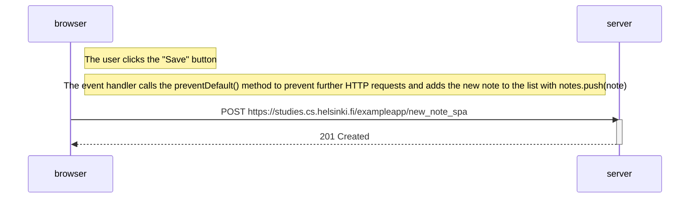

```mermaid
    sequenceDiagram
    participant browser
    participant server

    note right of browser:The user clicks the "Save" button
    note right of browser:The event handler calls the preventDefault() method to prevent further HTTP requests and adds the new note to the list with notes.push(note) 

    browser->>server: POST https://studies.cs.helsinki.fi/exampleapp/new_note_spa
    
    activate server
    server-->>browser: 201 Created 
    deactivate server

  

    

```